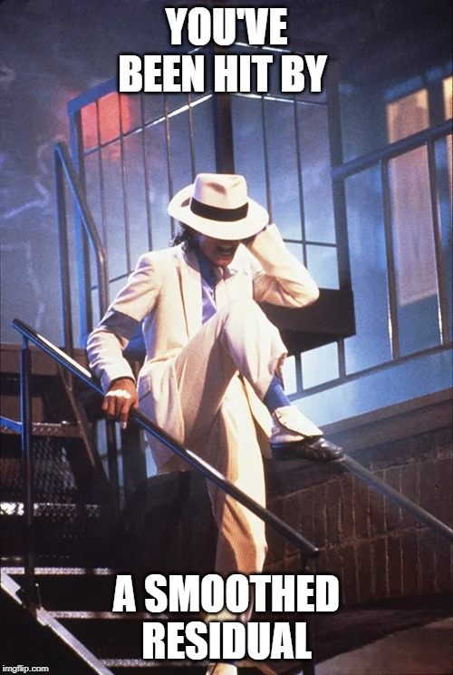
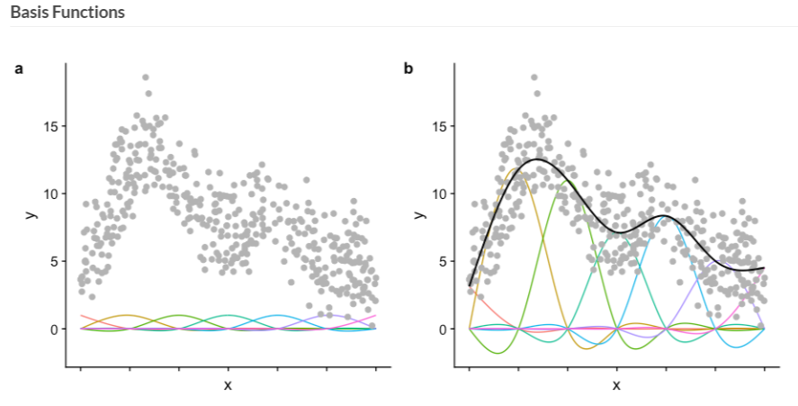

```{r setup, include=FALSE}
library(ragg)
#library(Cairo)
library(citr)
library(ggplot2)

options(htmltools.dir.version = FALSE)


knitr::opts_chunk$set(fig.width=12, fig.height=6, fig.align = "center", dev = "ragg_png"
                      #dev.args = list(png = list(type = "cairo"))
                      , fig.retina=3) 


## Set ggplot defaults
theme_set(
  theme_bw() +
    theme(legend.position = "right",
          plot.subtitle = element_text(face = "italic"
                                       , family = "sans"
                                       , size=10))
)


set.seed(123)

X <- c(runif(50, 0, 5), 0)
Y <- 2 + (1.5 * X[1:50]) + rnorm(50, 0, 0.5)
Y[51] <- 2

my_data <- data.frame(X, Y)

rm(list = c('X','Y'))

X <- c(2,3,3)
Y <- 2 + (1.5 * X)
Y[2] <- Y[1]
Y[3] <- Y[3] +0.05

dt2 <- data.frame(X, Y)

rm(list = c('X','Y'))

triangle<- data.frame(X=c(2.5, 3.2, 0),
Y = c(4.5, 5.8, 2.9), 
value=c("1", "1.5", "2"),
label= c("1", "\u03B2", "\u03B1" ))


```


.pull-left[

<br><br><br>

# Modelling non-linear data with Generalized Additive Models (GAMs)
### Using the `mgcv` package

<br><br>
<br>

`r icons::icon_style(icons::fontawesome("envelope"))` [c.mainey1@nhs.net](mailto:c.mainey1@nhs.net)
`r icons::icon_style(icons::fontawesome("github"))` [chrismainey](https://github.com/chrismainey)
`r icons::icon_style(icons::fontawesome("linkedin"), fill = "#005EB8")`  [chrismainey](https://www.linkedin.com/in/chrismainey/)
`r icons::icon_style(icons::fontawesome("orcid"), fill = "#A6CE39")` [0000-0002-3018-6171](https://orcid.org/0000-0002-3018-6171)
]

.pull-right[

<p style="text-align:center;font-weight:bold;">
<br>
Don't think about it too hard...`r emo::ji("wink")`  </p>


]

---

# Regression models on non-linear data

+ Regression is a method for predicting a variable, `Y`, using another, `X`

```{r regression1, echo=FALSE, message=FALSE, warning=FALSE, fig.alt="Two-dimensional scatterplot with a range of data points that show the two dimensions are correlated"}
library(ggplot2)

a<-ggplot(my_data, aes(x=X,y=Y))+
  geom_point()+
  scale_x_continuous(limits=c(0,5))+
  scale_y_continuous(breaks=seq(2,10,2))+
  theme(axis.title.y = element_text(vjust = 0.5,angle=0))

a
```
---

# Equation of a straight line (1)

$$y= \alpha + \beta x + \epsilon$$

```{r regression2, echo=FALSE, message=FALSE, warning=FALSE, fig.alt="The same scatter plot from the last slide now has a line of best fit drawn, highlighting where it crosses the vertical axis called the intercept or alpha. For each unit of 1 on the horizontal axis, the vertical axis raises by and amount called a coefficient, or beta."}
library(ggforce)
a+geom_smooth(col="red", method="lm")+
  geom_polygon(aes(x=X, y=Y), col="goldenrod", fill=NA, linetype="dashed", size=1.2, data=dt2)+
  geom_label(aes(x=X, y = Y, label=label), data=triangle)+
  geom_mark_circle(aes(x=0, y=2), col="goldenrod",  fill=NA, linetype="dashed", size=1.2)+
  theme(axis.title.y = element_text(vjust = 0.5,angle=0))
```


---

# Equation of a straight line (2)


$$y= 2 + 1.5 x + \epsilon$$

```{r regression3, echo=FALSE, message=FALSE, warning=FALSE, fig.alt="The same scatter plot from the last slide now has a line of best fit drawn, highlighting where it crosses the vertical axis called the intercept or alpha. For each unit of 1 on the horizontal axis, the vertical axis raises by and amount called a coefficient, or beta."}
a+geom_smooth(col="red", method="lm")+
  geom_polygon(aes(x=X, y=Y), col="goldenrod", fill=NA, linetype="dashed", size=1.2, data=dt2)+
  geom_label(aes(x=X, y = Y, label=value), data=triangle)+
  geom_mark_circle(aes(x=0, y=2), col="goldenrod",  fill=NA, linetype="dashed", size=1.2)+
  theme(axis.title.y = element_text(vjust = 0.5,angle=0))
```


---

# What about nonlinear data? (1)

```{r sig, echo=FALSE, message=TRUE, warning=FALSE, fig.alt="The same scatter plot from the first slide with no line of best fit"}
### Sigmoid function ### create a function to generate sigmoid pattern
sigmoid <- function(x, lower_asymptote, carrying_capacity, growth_rate, time_max) {
  return(lower_asymptote + ((carrying_capacity - lower_asymptote)/(1 + exp(-growth_rate * 
                                                                             (x - time_max)))))
}
X <- 1:100
X <- c(X, X+rnorm(X,X,2), X+rnorm(X, X, 5))
Y <- sigmoid(1:100, 1, 50, 0.2, 50) + rnorm(100, 0, 5)
Y <- c(Y, Y+rnorm(Y, Y, 3), Y+rnorm(Y, Y, 8))
dt<-data.frame(X,Y)

dt$cat<-factor(ifelse(dt$X<50, "a", ifelse(dt$X <150, "b", "c")))

dt$cat_pred<-predict(lm(dt$Y ~ dt$cat))

cuts <- data.frame(y = rep(unique(dt$cat_pred), each =2 ), x = c(0,50,50,150,150,max(dt$X)))

ggplot(dt, aes(y=Y, x=X))+
  geom_point(size=1.5, alpha=0.4)+
  theme(axis.title.y = element_text(vjust = 0.5,angle=0))

```


---

# What about nonlinear data? (2)

```{r cats, echo=FALSE, message=FALSE, warning=FALSE, fig.height=6.5, fig.alt="The same scatter plot from the first slide with a straight line of best fit."}
ggplot(dt, aes(y=Y, x=X))+
  geom_point(size=1.8, alpha=0.4)+
  geom_smooth(aes(col="A"), method = "lm",  se=FALSE, size=1.3)+
  #geom_line(aes(y=y, x=x, col="B"),  size=1.3, data = cuts)+
  #geom_smooth(aes(col="C"), method = "lm", formula= y~poly(x, 3),  se=FALSE, size=1.3)+
  scale_color_manual(values = c("#5DDEDE", "#FAD74B" ,"#FA6767"),
                     labels= factor(x=c("A", "B", "C"), levels=c("A", "B", "C"), labels=c("Linear", "Categorical", "Polynomial"), ordered=TRUE)
                     , name="Type of fit")+
  #ggtitle("Varying approximations for non-linear relationships")+
  theme(legend.position = "bottom",
        legend.title = element_text(face="bold", size=10),
        legend.text = element_text(size=9),
        plot.title = element_text(size = 12, face="bold") )
```
---

# What about nonlinear data? (3)

```{r cats3, echo=FALSE, message=FALSE, warning=FALSE, fig.height=6.5, fig.alt="The same scatter plot from the first slide with boxes for 3 categories added."}
ggplot(dt, aes(y=Y, x=X))+
  geom_point(size=1.8, alpha=0.4)+
  #geom_smooth(aes(col="A"), method = "lm",  se=FALSE, size=1.3)+
  geom_line(aes(y=y, x=x, col="B"),  size=1.3, data = cuts)+
  #geom_smooth(aes(col="C"), method = "lm", formula= y~poly(x, 3),  se=FALSE, size=1.3)+
  scale_color_manual(values = c("#FAD74B" ,"#FA6767"),
                     labels= factor(x=c("B", "C"), levels=c("B", "C"), labels=c("Categorical", "Polynomial"), ordered=TRUE)
                     , name="Type of fit")+
  #ggtitle("Varying approximations for non-linear relationships")+
  theme(legend.position = "bottom",
        legend.title = element_text(face="bold", size=10),
        legend.text = element_text(size=9),
        plot.title = element_text(size = 12, face="bold") )
```
---

# What about nonlinear data? (4)

```{r cats4, echo=FALSE, message=FALSE, warning=FALSE, fig.height=6.5, fig.alt="The same scatter plot from the first slide with with a smooth sigmoidal shape fitted to the points"}
ggplot(dt, aes(y=Y, x=X))+
  geom_point(size=1.8, alpha=0.4)+
  #geom_smooth(aes(col="A"), method = "lm",  se=FALSE, size=1.3)+
  #geom_line(aes(y=y, x=x, col="B"),  size=1.3, data = cuts)+
  geom_smooth(aes(col="C"), method = "lm", formula= y~poly(x, 3),  se=FALSE, size=1.3)+
  scale_color_manual(values = c("#FA6767"),
                     labels= factor(x=c("C"), levels=c("C"), labels=c("Polynomial"), ordered=TRUE)
                     , name="Type of fit")+
  #ggtitle("Varying approximations for non-linear relationships")+
  theme(legend.position = "bottom",
        legend.title = element_text(face="bold", size=10),
        legend.text = element_text(size=9),
        plot.title = element_text(size = 12, face="bold") )
```
---

# What about nonlinear data? (5)

```{r cats5, echo=FALSE, message=FALSE, warning=FALSE, fig.height=6.5, fig.alt="The same scatter plot from the first slide with a straight line, categorical and the a smooth sigmoidal shapes fitted to the points."}
ggplot(dt, aes(y=Y, x=X))+
  geom_point(size=1.8, alpha=0.4)+
  geom_smooth(aes(col="A"), method = "lm",  se=FALSE, size=1.3)+
  geom_line(aes(y=y, x=x, col="B"),  size=1.3, data = cuts)+
  geom_smooth(aes(col="C"), method = "lm", formula= y~poly(x, 3),  se=FALSE, size=1.3)+
  scale_color_manual(values = c("#5DDEDE", "#FAD74B" ,"#FA6767"),
                     labels= factor(x=c("A", "B", "C"), levels=c("A", "B", "C"), labels=c("Linear", "Categorical", "Polynomial"), ordered=TRUE)
                     , name="Type of fit")+
  #ggtitle("Varying approximations for non-linear relationships")+
  theme(legend.position = "bottom",
        legend.title = element_text(face="bold", size=10),
        legend.text = element_text(size=9),
        plot.title = element_text(size = 12, face="bold") )
```
---

.pull-left[

# Poly - what?

+ More complicated mathsy definitions than I can explain, first lets consider powers / orders:

  + Squared ( $x^2$ or $x * x$)

  + Cubed ( $x^3$ or $x * x * x$)

<br><br>

If we use these in regression, we can get something like:

$$y = \alpha + \beta_1x + \beta_2x^2 + \beta_3x^3... + \beta_nx_n^z$$
]

--

.pull-right[

## Problems with polynomials

+ Dodgy fit with increased complexity

+ Can oscillate wildly, particularly at edges:
  + [Runge's phenomenon](https://en.wikipedia.org/wiki/Runge%27s_phenomenon#:~:text=In%20the%20mathematical%20field%20of,set%20of%20equispaced%20interpolation%20points.)


<p style="text-align:center;"><a title="Nicoguaro, CC BY 4.0 &lt;https://creativecommons.org/licenses/by/4.0&gt;, via Wikimedia Commons" href="https://commons.wikimedia.org/wiki/File:Runge_phenomenon.svg"></a></p>

]

---

# Degrees of freedom (df)

Within a model, how many 'parts' are free to vary?

E.g. If we have 3 numbers and we know the average is 5:

If we have 2 and 7, our final number is not free to vary.
It must be 6:
$$ \frac{2 + 7 + 6}{3} = 5$$
This means our 'model' is constrained to $n-1$ degrees of freedom


--

## In regression context:

+ The number of data points in our model ( $N$ ) limits the df
+ Usually the number of predictors ( $k$ ) in our model is considered the df (one of these is the intercept)
+ "Residual df" are points left to vary in the model, after considering the df:

$$N-k-1$$
Helpful post on [CrossValidated](https://stats.stackexchange.com/questions/340007/confused-about-residual-degree-of-freedom)

---

# Overfitting

 > When our model fits both the underlying relationship and the 'noise' percuiliar to our sample data
 
 + You want to fit the relationship, whilst minimising the noise.
 
 + This helps 'generalizability': meaning it will predict well on new data.
 

If we allowed total freedom in our model, e.g. a knot at every data point. What would happen?

---
class: middle

# Exercise 1a: Load and fit non-linear relationship
Here we will visualise the relationship, view it as a linear regression, and attempt a polynomial fit.


---

# What if we could do something more suitable?

If we could define a set of functions we are happy with:
+ We could use coefficients to 'support' the fit
+ Could use penalties to restrict how much they flex


<p style="text-align:center;font-weight:bold;"></p>

.smaller[
Figure taken from Noam Ross' GAMs in R course, CC-BY, https://github.com/noamross/gams-in-r-course
]


---

# Splines

+ How do you (manually) draw a smooth curve?

--

.pull-left[


### [Draftsman's spline](https://www.core77.com/posts/55368/When-Splines-Were-Physical-Objects) / ['flat spline'](https://en.wikipedia.org/wiki/Flat_spline)

+ Thin flexible strip that bends to curves

+ Held in place by weights ("ducks"), nails etc.

+ The tension element is important: spline flexes minimally

]

.pull-right[

<p style="text-align:center;"><a title="Pearson Scott Foresman, Public domain, via Wikimedia Commons" href="https://commons.wikimedia.org/wiki/File:Spline_(PSF).png"></a> </p>

]

---

# Mathematical splines

+ Smooth, piece-wise polynomials, like a flexible strip for drawing curves.
+ 'Knot points' between each section

```{r gam1, echo=FALSE, message=FALSE, warning=FALSE, fig.alt="Scatter plot from earlier with a wiggly sigmoidal best fit line"}
library(splines)
ggplot(dt, aes(y=Y, x=X))+
  geom_point(size=1.5, alpha=0.4)+
  geom_smooth(aes(col="A"), method = "lm", formula = y~ns(x,10), se=FALSE, size=1.2, show.legend = FALSE)
```


---

# How smooth?

Can be controlled by number of knots $(k)$, or by a penalty $\gamma$.

.pull-left[
```{r knots2, echo=FALSE, message=FALSE, warning=FALSE, fig.width=6, fig.alt="Scatter plot from earlier with a wiggly sigmoidal best fit lines for 2, 20 and 50 points"}
library(viridis)
library(mgcv)

knotplot<-factor(c("3-knots" = "#5DDEDE", "20-knots" =  "#FAD74B" , "50-knots" ="#FA6767" ), ordered = TRUE)
knotplot<-factor(c("#5DDEDE", "#FAD74B" , "#FA6767" ), labels = c("3-knots", "20-knots" , "50-knots"), ordered = TRUE)

knotplot<-c("#5DDEDE"="3", "#FAD74B"="20" ,"#FA6767"="50") 
k2<-as.factor(knotplot)

ggplot(dt, aes(y=Y, x=X))+
  geom_point(size=1.5, alpha=0.4)+
   geom_smooth(aes(col="A"), method = "lm", formula = y~ns(x,4), se=FALSE, size=1.2)+
   geom_smooth(aes(col="B"), method = "lm", formula = y~ns(x,31), se=FALSE, size=1.2)+
   geom_smooth(aes(col="C"), method = "lm", formula = y~ns(x,51), se = FALSE, size=1.2)+
   scale_color_manual(values = c("#5DDEDE", "#FAD74B" ,"#FA6767"),
                     labels= factor(x=c("A", "B", "C"), levels=c("A", "B", "C"), labels=c("3", "20", "50"), ordered=TRUE)
                     , name="Knots")+

  # scale_color_discrete(#values = c("#5DDEDE", "#FAD74B" ,"#FA6767")
  #                    breaks= c("3","20","50"), name="Knots" )+
  labs(title= "Changing number of knots")+
  theme(legend.title = element_text(face="bold", size=9),
        legend.text = element_text(size=8),
        legend.position = "bottom",
        plot.title = element_text(size = 11, face="bold") )


```
]

.pull-right[
```{r penalty, echo=FALSE, message=FALSE, warning=FALSE, fig.width=6, fig.alt="Scatter plot from earlier with a wiggly sigmoidal best fit lines for 20 knots but differing penalties 0.001, 1 and 10"}
########### Use gam sim for sigmoid and show difference in gamma ###############

smsp<-gam(Y~s(X, bs="cr", k=20), data=dt, sp=1)
dt$sp1<-predict(smsp, type="response")

smsp2<-gam(Y~s(X, bs="cr", k=20), data=dt, sp = 10 )
dt$sp2<-predict(smsp2, type="response")

smsp3<-gam(Y~s(X, bs="cr", k=20), data=dt, sp = 100)
dt$sp3<-predict(smsp3, type="response")


#dt$sp1<-NULL
ggplot(dt, aes(y=Y, x=X))+
  geom_point(alpha=0.4)+
  geom_line(aes(y=sp1, x=X, col="1"), size=1.2)+
  geom_line(aes(y=sp2, x=X, col="10"), size=1.2)+
  geom_line(aes(y=sp3, x=X, col="100"), size=1.2)+
  scale_color_manual(values = c("#5DDEDE", "#FAD74B" ,"#FA6767"),
                     labels= factor(x=c("A", "B", "C"), levels=c("A", "B", "C"), labels=c("1", "10", "100"), ordered=TRUE)
                     , name="Penalty (\u03B3)")+
  ggtitle("Varying smoothness penalty (20 knots)")+
    theme(legend.title = element_text(face="bold", size=09),
        legend.text = element_text(size=8),
        legend.position = "bottom",
        plot.title = element_text(size = 11, face="bold") )
  
```

]

---

class: middle

# Exercise 1b: Fitting a spline to our data
We will now use a spline function to trace the relationship in our data, through a regression, and plot it.

---

---

# Generalized Additive Model

+ Regression models where we fit smoothers (like splines) from our data.
+ Strictly additive, but smoothers can describe complex relationships.
+ In our case:


$$y= \alpha + f(x) + \epsilon$$
--

<br>
.smaller[
Or more formally, an example GAM might be (Wood, 2017):
]

$$g(\mu_i) = A_i \theta + f_1(x_1) + f_2(x_{2i}) + f3(x_{3i}, x_{4i}) + ...$$
<br>
Where:

.smaller[
+ $\mu_i \equiv \mathbb{E}(Y _i)$, the expectation of Y]

.smaller[
+ $Yi \sim EF(\mu _i, \phi _i)$, $Yi$ is a response variable, distributed according to exponential family distribution with mean $\mu _i$ and shape parameter $\phi$.]

.smaller[
+ $A_i$ is a row of the model matrix for any strictly parametric model components with $\theta$ the corresponding parameter vector.]

.smaller[
+ $f_i$ are smooth functions of the covariates, $xk$, where $k$ is each function basis.]

---
# What does that mean for me?

+ Can build regression models with smoothers, particularly suited to non-linear, or noisy data

+ _Hastie (1985)_ used knot every point, _Wood (2017)_ uses reduced-rank version

--

## Issues

+ We need to chose the right _dimension_ (degrees of freedom / knots) for our smoothers
+ We need to chose the right penalty ( $\lambda$ ) for our smoothers

### Consequence

+ If you penalise a smooth of $k$ dimensions, it no longer has $k-1$ degrees of freedom as they are reduced
+ 'Effective degrees of freedom' - the penalized df of the predictors in the model.

__Note:__
<br>
$df(\lambda) = k$, when $\lambda = 0$ 
<br>
$df(\lambda) \rightarrow 0$, when $\lambda \rightarrow \infty$ 


---

# mgcv: mixed gam computation vehicle

+ Prof. Simon Wood's package, pretty much the standard
+ Included in standard `R` distribution, used in `ggplot2` `geom_smooth` etc.
+ Has sensible defaults for dimensions
+ Estimates the ideal penalty for smooths by various methods, with REML recommended.

--

```{r gam}
library(mgcv)

my_gam <- gam(Y ~ s(X, bs="cr"), data=dt)
```

+ `s()` controls smoothers (and other options, `t`, `ti`)
+ `bs="cr"` telling it to use cubic regression spline ('basis')
+ Default determined from data, but you can alter this e.g. (`k=10`)
+ Penalty (smoothing parameter) estimation method is set to (`REML`)
---

# Model Output:
```{r gam2}
summary(my_gam)
```


---
# Check your model:

```{r gam3, eval=FALSE}
gam.check(my_gam)
```

```{r gam3a, echo=FALSE}
gam.check(my_gam)
```

---
# Check your model:

```{r gam3b, eval=FALSE}
gam.check(my_gam)
```

```{r gam3c, echo=FALSE, fig.show= 'hide', fig.alt="Four diagnostic plots for models, examining fit against residuals"}
gam.check(my_gam)
```

---

# Is it any better than linear model?

```{r lmcomp}
my_lm <- lm(Y ~ X, data=dt)

anova(my_lm, my_gam)

AIC(my_lm, my_gam)
```

--

## Yes, yes it is!

---
class: middle

# Exercise 2: Simple GAM fit
We will now fit the same relationship with a GAM using the  `mgcv` package.


---
class: middle

# Break

---
class: middle

# Exercise 3: GAM fitting options
We will now look at varying the fit using things, like the degrees of freedom and penalty, that affect the smoothers (splines).
We will also visualise these changes and effects on models.

---
# Advanced elements (1)

The name of the model class is ___'Generalized Additive Model' (GAM)___  - like the ___'Generalized Linear Model' (GLM)___
+ This means we can fit other types of response distribution: e.g. Poisson or Negative Binomial for counts, binomial ("Logistic regression") for binary outcomes etc.
+ This is achieved using a 'link' function: log for Poisson, logit for binomial.  

<br><br>
The main addition here is the `family` argument:

```{r gam_genralized, eval=FALSE}
my_logistic_gam <- gam(Y ~ s(X, bs="cr"), data=dt, family = "binomial")
```

--

As with a GLM, the results are on the scale of the link function, so have to transform predictions back to the response scale:

```{r gam_logisitic_preds, eval=FALSE}
predict(my_logistic_gam, newdata, type="response")
```

---
# Advanced elements (2)

## Interactions

Sometimes our predictors are not independent of each other, and you may want to isolate the individual and combined effects.

  + Smoking and drinking were highly linked: as people would often drink and smoke at pubs.
  + A stroke drug trial might have different effects on recover depending on severity of the stroke.
  
--

In a GLM, you would add this with a multiplicative interaction term:
```{r glm_genralized, eval=FALSE}
my_interaction_model <- glm(Y ~ X * Z , data=dt, family = "binomial")
```

--
You can't do the same thing in an additive model, but you can make multidimensional smoothers:

```{r gam_genralized_te, eval=FALSE}
# Within 's' - assuming they are on the same scale
my_interaction_gam1 <- gam(Y ~ s(X,Z), data=dt, family = "binomial")

# As a tensor product, using te, if on different scales
my_interaction_gam2 <- gam(Y ~ te(X,Z), data=dt, family = "binomial")
```


---
class: middle

# Exercise 4: Multivariable GAMs
We will now generalise to include more than one predictor / smooth function, how they might be combined, and effects on models.  We will also progress on to a generalised linear model, using a distribution family


---
class: middle

# Exercise 5: Put it all together!
We will now apply what we've learnt to the Framingham cohort study, predicting the binary variable: 'TenYearCHD' using other columns.  See how you can use smoothers on the continuous variables to get the best fit possible.

___Hint:___ you will need to use AIC or AUC/ROC to compare models, not R2.

---

# Summary

+ Regression models are concerned with explaining one variable: `y`, with another: `x`

+ This relationship is assumed to be linear

+ If your data are not linear, or noisy, a smoother might be appropriate

--

+ Splines are ideal smoothers, and are polynomials joined at 'knot' points

--

+ GAMs are a framework for regressions using smoothers

--

+ `mgcv` is a great package for GAMs with various smoothers available

+ `mgcv` estimates the required smoothing penalty for you

+ `gratia` or `mgcViz` packages are good visualization tool for GAMs

---
# References and Further reading:

#### GitHub code: https://github.com/chrismainey/GAMworkshop


#### Simon Wood's comprehensive book:
+ WOOD, S. N. 2017. Generalized Additive Models: An Introduction with R, Second Edition, CRC Press.


#### Noam Ross free online GAM course: https://noamross.github.io/gams-in-r-course/

#### Kim Larson's great intro article: https://multithreaded.stitchfix.com/blog/2015/07/30/gam/

<br>

+ HARRELL, F. E., JR. 2001. Regression Modeling Strategies, Springer-Verlag.

+ HASTIE, T. & TIBSHIRANI, R. 1986. Generalized Additive Models. Statistical Science, 1, 297-310. 291

+ HASTIE, T., TIBSHIRANI, R. & FRIEDMAN, J. 2009. The Elements of Statistical Learning : Data Mining, Inference, and Prediction, Springer.
